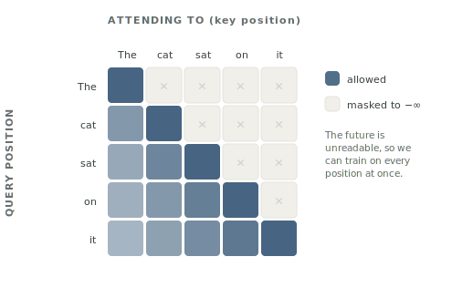

# CLAUDE.md — authoring guide for *Foundations of Large Language Models*

This is a static, bookdown-style textbook about LLMs, generated from Markdown by
a small Python build. Read this file before editing anything.

## What this book is

- **Audience.** A reader who already knows deep-learning basics (can read a
  training loop, knows gradients, has used PyTorch/JAX) and wants the current,
  load-bearing picture of LLMs — the set of ideas needed to build with them and
  to *ace an LLM engineering interview in 2026*.
- **Goal.** Not encyclopedic. The essential concepts, in the order things happen
  to a model: architecture → pretraining → alignment → serving → the harness
  (system prompts, tools, RAG, agents, guardrails) → evaluation → the frontier.
- **The reader learns from examples and intuition.** Every hard idea should be
  anchored by a one-sentence intuition and, where it helps, a concrete analogy.

## Voice and style (match this closely)

The four drafted chapters — `00-preface`, `01-introduction`, `04-transformer`,
`A-local-llms` — are the style reference. Imitate them.

- **Concise and intuitive over exhaustive.** Lead with the mental model, then
  add precision. Cut anything that does not earn its place.
- **Analogies are welcome but must be honest.** When you give an analogy, say
  where it leaks (see the "reading a mystery novel" analogy in Chapter 4).
- **Every chapter should carry its weight in callouts:** at least one Intuition
  box, and Interview boxes for the questions a candidate is actually asked.
- **Second person, active voice, present tense.** "The model reads a sequence,"
  not "sequences are read by the model."
- **Cross-reference by chapter** ("the KV cache, Chapter 15") so the book feels
  like one argument, not disconnected notes.
- **No em-dashes as a crutch and no filler.** Prefer plain verbs.
- Keep a chapter to roughly 800–1,600 words unless the topic truly needs more.

## Repository layout

```
toc.py                  Single source of truth: parts, chapters, labels, outlines.
references.py           Single source of truth for cited works (see Citations).
content/<slug>.md       One Markdown file per drafted chapter. Optional.
figures/make_figures.py Generates every figure as SVG into assets/figures/.
assets/style.css        The entire look. No web fonts; macOS-native serif/sans.
assets/figures/*.svg    GENERATED figures. Do not hand-edit; regenerate instead.
build.py                Generator. Reads toc.py + content/, writes docs/.
docs/                   BUILD OUTPUT. Never edit by hand; gitignored.
.github/workflows/      CI that rebuilds and deploys to GitHub Pages on push.
```

## How to build

```bash
pip install markdown pymdown-extensions pygments matplotlib   # once
python figures/make_figures.py                     # regenerates all figures
python build.py                                    # regenerates all of docs/
```

Open `docs/index.html` in a browser, or serve the folder with
`python -m http.server -d docs` for clean relative links. Math requires an
internet connection (MathJax loads from a CDN); everything else works offline.

## How to write or edit a chapter

1. Find the chapter's `slug` in `toc.py` (e.g. `03-tokenization`).
2. Create `content/<slug>.md` and write the prose. **Do not** include the
   chapter's `# H1` title — the build adds it from `toc.py`. Start the body with
   normal paragraphs, then `## H2` sections.
3. Run `python build.py`. The stub is automatically replaced by your content.

To add, remove, or reorder chapters, edit the `BOOK`/`APPENDICES` structures in
`toc.py`. A chapter with no content file renders as a stub from its `outline`,
so the book is always fully navigable.

## Markdown conventions

### Section numbering (important)

The build numbers `##` as `<label>.<n>` and `###` as `<label>.<n>.<m>`
automatically. **Every chapter must open each subsection under a numbered `##`
section** — an `###` before any `##` will fail an assertion in `build.py`. Do not
write section numbers by hand.

### Callout boxes

Use Python-Markdown admonition syntax. Supported types (styled in `style.css`):

```markdown
!!! intuition "Intuition"
    The one-sentence mental model.

!!! analogy "Analogy"
    A concrete comparison. Say where it leaks.

!!! interview "Interview"
    *A question you'd be asked.* The crisp answer.

!!! note "Note"
    A useful aside.

!!! warning "Common trap"
    Where people get it wrong.

!!! figure "Figure 4.1. Caption text."
    A prose description of the figure to be drawn. Renders as a dashed
    placeholder box; replace with a real diagram/image later.
```

Keep the title argument matching the type (e.g. `!!! interview "Interview"`).

### Citations

Cite a work with `[@key]` in the prose, or `[@key1; @key2]` for several at
once. The build replaces it with a linked author-year citation — "(Vaswani et
al., 2017)" — and appends a **References** section to any chapter that cites
something, listing exactly the works that chapter cites. Keys live in
`references.py`; an unknown key fails the build.

* **When to cite:** where a claim rests on a specific source — an
  architecture's origin, an empirical finding, a named method. Not every
  sentence; a reader should meet a citation only where they might reasonably
  ask "says who?". Prose should read naturally with the parenthetical removed.
* **Adding an entry:** append a `Reference` to `_ENTRIES` in `references.py`
  (key style: `vaswani2017`, first-author family name + venue/publication
  year). **Verify against the actual paper** — arXiv id, author list and
  order, year, title — before committing; a wrong citation is worse than none.
  Prefer the arXiv id when one exists; otherwise a stable `url` (DOI,
  publisher, or author-hosted page).
* Citations inside fenced code blocks are ignored. Do not hand-write
  reference lists or bibliography sections; the build owns them.
* The build prints a note listing entries that are not yet cited anywhere —
  harmless while chapters are pending, worth pruning if an entry becomes
  permanently orphaned.

### Math

Write LaTeX with `$...$` inline and `$$...$$` on their own lines for display.
The `pymdownx.arithmatex` extension normalizes these for MathJax.

### Code

Use fenced code blocks with a language tag. Keep code schematic and short;
follow the reader's code preferences in illustrative Python: Black style, full
sentences in comments ending with a period, assertions over silent fallbacks.

### Figures

Figures are **generated as SVG by `figures/make_figures.py`**, not drawn by hand
and not committed as binaries. Two kinds:

* **Diagrams** (concepts: attention, the causal mask, the model lifecycle) are
  hand-authored SVG emitted from Python string templates. A plotting library
  fights you here; raw SVG does not.
* **Plots** (anything quantitative: scaling curves, memory, throughput) are
  matplotlib, saved with `transparent=True` and `svg.fonttype: "none"` so the
  text inherits the page's fonts and the figure sits on the paper background.

Both use the palette constants at the top of `make_figures.py`, which mirror
`assets/style.css`. **Keep them in sync** — if you change the CSS palette,
change those constants.

To add a figure:

1. Write a `fig_*()` function in `figures/make_figures.py` that returns the
   path it wrote, and add it to the `FIGURES` tuple.
2. Run `python figures/make_figures.py`, then `python build.py`.
3. Reference it in Markdown with a raw `<figure>` block:

```html
<figure>

<figcaption>The caption. Say what the reader should take away, not just what is drawn.</figcaption>
</figure>
```

Add `class="wide"` to the `<figure>` to let a roomy figure bleed into the rail's
gutter on wide screens.

**Do not number figures by hand.** `build.py` numbers each `<figcaption>` in
document order as `Figure <label>.<n>`, matching the section scheme, so
reordering chapters renumbers figures automatically. It also **asserts that
every referenced image exists**, so a broken path fails the build instead of
shipping a missing image.

Captions should carry an idea, not a label. "Why quantization makes a model
faster, not just smaller" beats "Tokens/sec vs model size."

The `!!! figure` admonition still exists as a *placeholder* for a figure that
has not been drawn yet: it renders as a dashed box describing what to draw.
Replace placeholders with real `<figure>` blocks as you go.

## Code preferences for `build.py` and `toc.py`

The author writes research code and values correctness above all:

- **Black formatting.** Run `black build.py toc.py` after edits.
- **Assert on the unexpected.** Prefer assertions that fail loudly over silent
  defaults or fallbacks. The build already asserts on empty content, duplicate
  slugs, missing outlines, and malformed heading order — keep that spirit.
- **No new default arguments.** When a function gains a parameter, update all
  call sites rather than defaulting it; it is fine for old code to fail.
- **Full-sentence comments end with a period.** (Tiny shape/inline notes are
  exempt.)

## Content status

Drafted: all of Part I (`preface`, `introduction`, `deep-learning-refresher`,
`tokenization`, `transformer`, `modern-architectures`) and `local-llms`. The
original style references are `preface`, `introduction`, `transformer`, and
`local-llms`.

Everything else is a stub driven by its `outline` in `toc.py`. Suggested order
to fill in: `09-scaling-laws`, then Part III (`10`–`13`), then the harness
(Part V), which is the most interview-relevant and least standard across other
resources.

## Definition of done for a chapter

- Opens with a paragraph that states the chapter's core idea in plain terms.
- Every `##` section has a clear job; no section is filler.
- At least one Intuition box and the Interview questions a candidate would face.
- Analogies name where they leak.
- Cross-references to related chapters are present and correct.
- Load-bearing claims carry `[@key]` citations, each verified against the
  actual paper (see Citations above).
- `python build.py` runs clean and the page reads well in a browser.

## Deployment

The book is published to GitHub Pages by `.github/workflows/deploy.yml`, which
reinstalls dependencies, regenerates the figures, and runs `build.py` on every
push to `main`. `docs/` is gitignored — **never commit build output**, and never
"fix" the live site by editing HTML; fix the source and push.

Because CI runs the build, **a failed assertion in `build.py` fails the deploy.**
That is intended: a missing figure or malformed heading order should block
publication rather than ship a broken page.

The layout is responsive and verified clean down to 320 px. If you add a wide
element (a big table, a code block with long lines, a figure), re-check that the
page does not scroll sideways on a phone.

## Slugs are permalinks

A chapter's `slug` is its **public URL** (`transformer` → `/transformer.html`).
Slugs are deliberately **semantic, not numbered**, so that reordering chapters in
`toc.py` changes only the displayed `label` — never a URL. External links and
bookmarks keep working.

**Do not rename a slug casually.** It breaks every link anyone has to that page.
If a rename is truly warranted, leave behind a redirect stub at the old path:

```html
<meta http-equiv="refresh" content="0; url=new-slug.html">
```

Figure filenames follow the same rule: name them for what they *show*
(`causal-mask.svg`), never for the chapter they currently live in.

## Integrating with a wider site

The config block at the top of `build.py` holds everything needed to fold the
book into a personal site. It is currently set for a standalone draft:

| Constant | Now | Effect when set |
|---|---|---|
| `SITE_NAME` / `SITE_URL` | empty | Adds a "← back to <site>" link atop the sidebar. Set both or neither (asserted). |
| `CANONICAL_BASE` | empty | Emits canonical + Open Graph tags so shared links preview nicely. |
| `DRAFT` | `True` | While true, every page carries `noindex` and `robots.txt` disallows crawlers. Flip to `False` to let the book be found. |

To match a site's palette later, override the CSS variables in the `:root` block
of `assets/style.css` — every color in the book derives from those, and the
figure palette constants in `figures/make_figures.py` mirror them.
